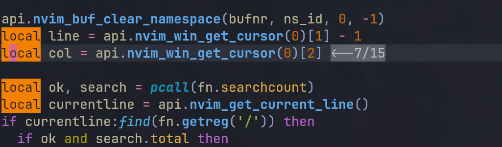

## Screenshot

## Description

**A plugin that highlight the search pattern**

**Will fail when search some strange characters :)😂**

## Highlight Group

- Default: `MatchParen`

## Version

my nvim version is `nightly`, and release is ok too
